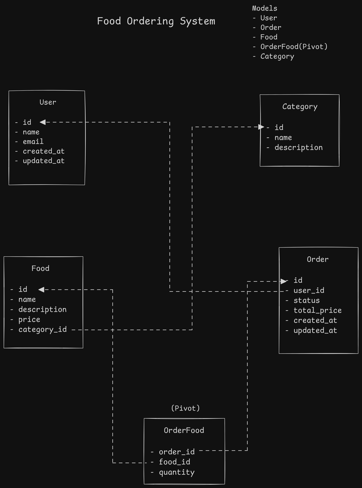
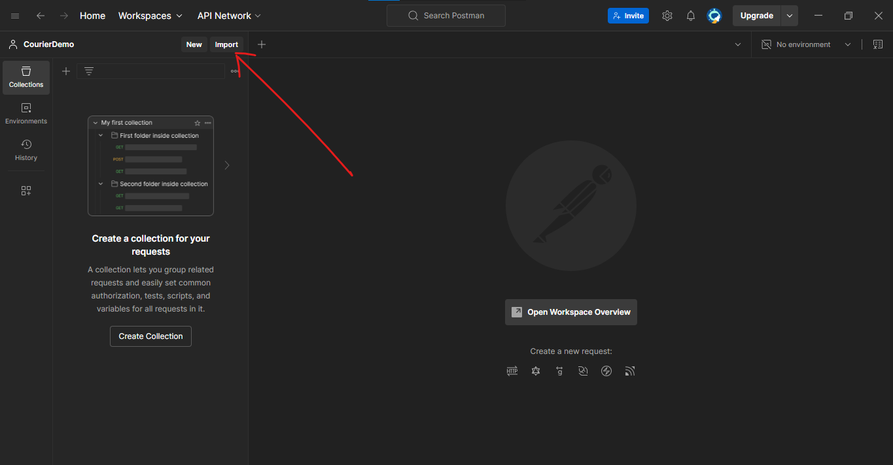
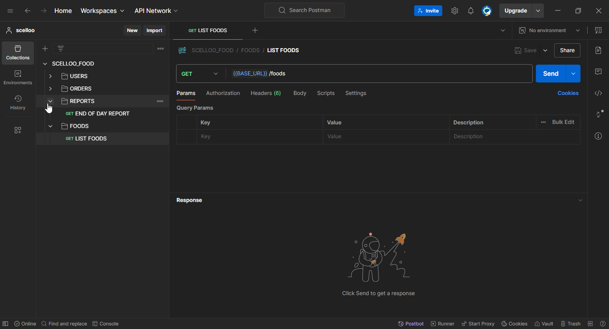

# Simple Food Ordering System

## Overview

This repo contains a solution to an assessment, i.e to build a rudimentary food ordering system with REST API endpoints for interaction and basic CRUD functionalities.



## Table of Contents

- [Simple Food Ordering System](#simple-food-ordering-system)
  - [Overview](#overview)
  - [Table of Contents](#table-of-contents)
  - [Get started](#get-started)
    - [Requirements](#requirements)
    - [Installation](#installation)
    - [Running the Application](#running-the-application)
  - [API Endpoints](#api-endpoints)
    - [Users](#users)
    - [Orders](#orders)
    - [Reports](#reports)

## Get started

### Requirements

You will need the following tools installed on your computer to run the project.

- [Nodejs](https://nodejs.org/en) (at least LTS)
- [Git](https://git-scm.com/downloads) (For source control)
- [PostgreSQL](https://www.postgresql.org/) (Database)
- [Postman](https://www.postman.com/) or cURL (For API testing)

### Installation

1. Clone the repo

   ```bash
   git clone https://github.com/di-void/scelloo_food.git
   cd scelloo_food
   ```

2. Install dependencies

   Run `npm install` to install project dependencies

   ```bash
   npm i # shorthand for 'install'
   ```

3. Environment setup

   Copy the example environment file to your environment file.

   ```bash
   cp .env.example .env
   ```

4. Fill in your correct Database credentials in the .env file

   ```bash
   # server port (optional)
   PORT=3000

   # Database Credentials
   DB_HOST=your-db-host
   DB_PORT=5432
   DB_NAME=your-db-name
   DB_USER=your-db-username
   DB_PASSWORD=your-db-password
   ```

5. Database migration and seeding

   > [!NOTE]
   > This command will seed the database with test food items, categories and a demo user.

   ```bash
   npm run db:seed
   ```

   You can also undo the seeding by passing the `undo` argument to the command.

   ```bash
   npm run db:seed undo
   ```

### Running the Application

1. Start the development server

   ```bash
   npm run dev
   ```

   This will start the application on your configured port. If you have not specified any ports in your `.env` file, it will default to port `3000`. [http://127.0.0.1:3000](http://127.0.0.1:3000)

2. API Testing (with Postman)
   - Import the provided Postman collection into your Postman application
     
   - Test the endpoints
     

## API Endpoints

(Optional) include a brief list of API routes if needed.

### Users

- `GET /api/v1/user` - Fetch all users
- `POST /api/v1/users` - Create a new user
- `DELETE /api/v1/users/{id}` - Delete a user

### Orders

- `GET /api/v1/orders` - Fetch all orders
- `POST /api/v1/orders` - Create a new order
- `PATCH /api/v1/orders/{id}` - Update an Order's status
- `DELETE /api/v1/orders/{id}` - Delete an order

### Reports

- `GET /api/v1/reports/end-of-day` - Generate and fetch order report
